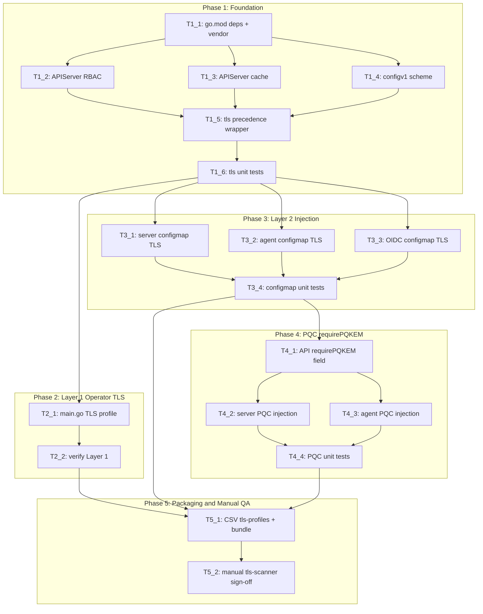

# Execution Backlog

**Feature:** Cluster-Wide TLS Profile Compliance and Hybrid Post-Quantum Key Exchange (OCPSTRAT-2611)

**AgentRoutingMode:** PROVIDED

**ConstitutionVersion:** 1.0 (2025-06-30)

## 0. Input coverage checklist

- **Plan Phase 1** (deps, RBAC, cache, tls wrapper) → T1_1–T1_6
- **Plan Phase 2** (Layer 1 operator TLS) → T2_1–T2_2
- **Plan Phase 3** (Layer 2 ConfigMap injection) → T3_1–T3_4
- **Plan Phase 4** (requirePQKEM + PQC config) → T4_1–T4_4
- **Plan Phase 5** (CSV + manual sign-off) → T5_1–T5_2
- **FR-001** (operator TLS profile) → T2_1, T2_2, T5_2
- **FR-002** (operand profile injection) → T3_1–T3_4, T5_2
- **FR-003** (profile change propagation) → T2_1, T3_1–T3_3, T5_2
- **FR-004** (no regression default profile) → T2_2, T3_4, T5_2
- **FR-005–FR-007** (PQC opt-in) → T4_1–T4_4, T5_2
- **FR-008** (warning events) → **Not implemented** (plan user feedback — no tasks)
- **FR-009** (CSV tls-profiles) → T5_1
- **FR-010** (APIServer RBAC/read) → T1_2, T1_3, T1_5, T1_6
- **FR-011** (six endpoints — operator injection) → T3_1–T3_3, T5_2
- **FR-012** (client TLS) → N/A — out of scope
- **FR-013** (restart not hot-reload) → T2_1, T3_1–T3_3 (hash-based rollout)
- **FR-014** (Intermediate fallback) → T1_5, T1_6, T3_4
- **FR-015** (configurable operand TLS — operator injection only) → T3_1–T3_3
- **FR-016** (opportunistic PQC) → T1_5, T1_6, T3_4
- **SC-001–SC-005, SC-007** → T5_2 (manual tls-scanner)
- **SC-006** (warning event) → N/A per plan feedback
- **Out of scope:** upstream SPIRE patches, image bumps, tls-scanner CI/e2e automation, vendor hand-edits, Kubernetes events

## 1. Task Dependency Graph (Mermaid)

## 2. Linear Execution Order (Chronological)

1. T1_1 — Add TLS dependencies to go.mod and run make vendor
2. T1_2 — Add APIServer read RBAC
3. T1_3 — Register APIServer in client cache/informers
4. T1_4 — Register config.openshift.io scheme in main.go
5. T1_5 — Implement pkg/controller/tls precedence wrapper using library-go helpers
6. T1_6 — Unit tests for tls precedence wrapper
7. T2_1 — Apply cluster TLS profile to operator metrics/webhook in main.go
8. T2_2 — Verify Layer 1 (make test, make verify)
9. T3_1 — Inject TLS profile into SPIRE server ConfigMap generator
10. T3_2 — Inject TLS profile into SPIRE agent ConfigMap generator
11. T3_3 — Inject TLS profile into OIDC ConfigMap generator
12. T3_4 — Unit tests for Layer 2 ConfigMap TLS injection
13. T4_1 — Add spec.requirePQKEM to ZTWIM CRD and regenerate manifests
14. T4_2 — PQC experimental config in server (+ ctrl-mgr) ConfigMap generators
15. T4_3 — PQC experimental config in agent ConfigMap generator
16. T4_4 — Unit tests for PQC precedence and config suppression
17. T5_1 — Enable CSV tls-profiles annotation and regenerate bundle
18. T5_2 — Manual tls-scanner cluster validation sign-off

## 6. Implementation progress

- [x] T1_1 — Add TLS dependencies to go.mod and run make vendor
- [x] T1_2 — Add APIServer read RBAC
- [x] T1_3 — Register APIServer in client cache/informers
- [x] T1_4 — Register configv1 APIServer scheme in main.go
- [ ] T1_5 — Implement pkg/controller/tls precedence wrapper using library-go helpers
- [ ] T1_6 — Unit tests for tls precedence wrapper
- [ ] T2_1 — Apply cluster TLS profile to operator metrics/webhook in main.go
- [ ] T2_2 — Verify Layer 1 (make test, make verify)
- [ ] T3_1 — Inject TLS profile into SPIRE server ConfigMap generator
- [ ] T3_2 — Inject TLS profile into SPIRE agent ConfigMap generator
- [ ] T3_3 — Inject TLS profile into OIDC ConfigMap generator
- [ ] T3_4 — Unit tests for Layer 2 ConfigMap TLS injection
- [ ] T4_1 — Add spec.requirePQKEM to ZTWIM CRD and regenerate manifests
- [ ] T4_2 — PQC experimental config in server (+ ctrl-mgr) ConfigMap generators
- [ ] T4_3 — PQC experimental config in agent ConfigMap generator
- [ ] T4_4 — Unit tests for PQC precedence and config suppression
- [ ] T5_1 — Enable CSV tls-profiles annotation and regenerate bundle
- [ ] T5_2 — Manual tls-scanner cluster validation sign-off (checklist artifact)

## 3. Task Execution Manifest (table)

| Task ID | Task Title | Assigned Agent | Phase | Depends On | Parallel OK | Complexity | Risk |
|---------|-----------|---------------|-------|-----------|------------|-----------|------|
| T1_1 | Add controller-runtime-common and library-go deps; make vendor | OperatorController_Agent | Phase 1 | none | No | 3 | Med |
| T1_2 | APIServer get/list/watch RBAC | RBACSecurity_Agent | Phase 1 | T1_1 | Yes | 2 | Low |
| T1_3 | APIServer in CustomCtrlClient cache | OperatorController_Agent | Phase 1 | T1_1 | Yes | 2 | Low |
| T1_4 | Register configv1 APIServer scheme in main | OperatorController_Agent | Phase 1 | T1_1 | Yes | 1 | Low |
| T1_5 | Implement tls precedence wrapper (library-go fetch helpers) | OperatorController_Agent | Phase 1 | T1_2, T1_3, T1_4 | No | 5 | Med |
| T1_6 | Unit tests: tls precedence matrix | Testing_Agent | Phase 1 | T1_5 | No | 3 | Low |
| T2_1 | Layer 1: operator metrics/webhook TLS + SecurityProfileWatcher | OperatorController_Agent | Phase 2 | T1_6 | No | 5 | Med |
| T2_2 | Verify Layer 1: make test and make verify | Testing_Agent | Phase 2 | T2_1 | No | 2 | Low |
| T3_1 | Layer 2: SPIRE server ConfigMap TLS injection | OperatorController_Agent | Phase 3 | T1_6 | Yes | 5 | Med |
| T3_2 | Layer 2: SPIRE agent ConfigMap TLS injection | OperatorController_Agent | Phase 3 | T1_6 | Yes | 3 | Med |
| T3_3 | Layer 2: OIDC ConfigMap TLS injection | OperatorController_Agent | Phase 3 | T1_6 | Yes | 3 | Med |
| T3_4 | Unit tests: Layer 2 ConfigMap TLS fields | Testing_Agent | Phase 3 | T3_1, T3_2, T3_3 | No | 5 | Med |
| T4_1 | API: add spec.requirePQKEM; make generate manifests | API_Agent | Phase 4 | T3_4 | No | 3 | Low |
| T4_2 | PQC: server + ctrl-mgr ConfigMap experimental.require_pq_kem | OperatorController_Agent | Phase 4 | T4_1 | Yes | 3 | Med |
| T4_3 | PQC: agent ConfigMap experimental.require_pq_kem | OperatorController_Agent | Phase 4 | T4_1 | Yes | 2 | Med |
| T4_4 | Unit tests: PQC overrides profile injection | Testing_Agent | Phase 4 | T4_2, T4_3 | No | 3 | Med |
| T5_1 | CSV tls-profiles true; make bundle | OLMRelease_Agent | Phase 5 | T2_2, T3_4, T4_4 | No | 2 | Low |
| T5_2 | Manual tls-scanner validation checklist (cluster) | Testing_Agent | Phase 5 | T5_1 | No | 3 | Med |

## 4. Task Specifications (Payloads)

### Task T1_1: Add controller-runtime-common and library-go deps; make vendor

- **Objective:** Introduce TLS helper dependencies without hand-editing vendor.
- **Target file(s):** `go.mod`, `go.sum`, `vendor/` (via `make vendor` only)
- **Non-goals / forbidden edits:** No hand-edits in `vendor/`; no `replace` directive unless `go mod tidy` fails and SME approves; no unrelated dependency bumps
- **Implementation notes:** Add `github.com/openshift/controller-runtime-common` and ensure `github.com/openshift/library-go` is available for `fetchTLSProfile` / `fetchTlsAdherence`. Align versions with CPMSO reference (plan open question #1). Run `make vendor` and commit `go.mod`, `go.sum`, `vendor/` together.
- **Acceptance criteria:** `go build ./...` succeeds; `git diff vendor/` is entirely from `make vendor`; no manual vendor file edits (FR-010 prerequisite)
- **Downstream handoff:** T1_2–T1_5 can import library TLS packages

### Task T1_2: APIServer get/list/watch RBAC

- **Objective:** Grant operator read access to cluster APIServer TLS configuration (FR-010).
- **Target file(s):** `config/rbac/role.yaml`, generated `config/rbac/role_binding.yaml` / bundle RBAC via `make manifests`
- **Non-goals / forbidden edits:** No write verbs on APIServer; no broadening unrelated RBAC
- **Implementation notes:** Add kubebuilder RBAC marker or manifest rule for `apiservers.config.openshift.io` resources `get`, `list`, `watch` only. Human approval gate per constitution for RBAC broadening — read-only is pre-approved scope.
- **Acceptance criteria:** RBAC manifest contains APIServer read rule; `make manifests verify` passes
- **Downstream handoff:** Operator can list/watch APIServer at runtime

### Task T1_3: APIServer in CustomCtrlClient cache

- **Objective:** Enable reconcile-time Get of APIServer/cluster without uncached API reader on hot path.
- **Target file(s):** `pkg/client/client.go`
- **Non-goals / forbidden edits:** Do not add label selectors to cluster-scoped APIServer; do not modify CustomCtrlClient interface unless required
- **Implementation notes:** Add `configv1.APIServer{}` to `cacheResourceWithoutReqSelectors` and `informerResources` lists per repo-assessment §5.
- **Acceptance criteria:** APIServer type registered in cache builder; `make test` passes for client package if tests exist
- **Downstream handoff:** T1_5 can use CustomCtrlClient to fetch APIServer during reconcile

### Task T1_4: Register configv1 APIServer scheme in main

- **Objective:** Allow manager/client to decode APIServer objects.
- **Target file(s):** `cmd/zero-trust-workload-identity-manager/main.go`
- **Non-goals / forbidden edits:** No TLS profile logic in this task — scheme registration only
- **Implementation notes:** `configv1.Install(scheme)` in `init()` or before manager creation alongside existing OpenShift scheme registrations.
- **Acceptance criteria:** Operator compiles; no scheme registration errors at startup
- **Downstream handoff:** T1_5 and T2_1 can decode APIServer

### Task T1_5: Implement tls precedence wrapper (library-go fetch helpers)

- **Objective:** Centralize TLS config resolution with library helpers and ZTWIM PQC precedence (FR-014, FR-016).
- **Target file(s):** `pkg/controller/tls/tls.go` (new)
- **Non-goals / forbidden edits:** Do not reimplement fetchTLSProfile/fetchTlsAdherence — delegate to library-go; do not emit Kubernetes events; no upstream image changes
- **Implementation notes:** Export `ResolveEffectiveTLSConfig(ctx, client, ztwim)` returning structured result: RequirePQKEM, strict adherence flag, min TLS version string, cipher suite list, injection source enum. Use library-go `fetchTLSProfile` and `fetchTlsAdherence`. Apply precedence matrix from plan §1. When `requirePQKEM=true`, signal callers to inject PQC only (no profile fields).
- **Acceptance criteria:** Package compiles; precedence logic covers all plan matrix rows
- **Downstream handoff:** T3_x and T4_x call this wrapper from configmap generators; T2_1 may reuse profile fetch for Layer 1

### Task T1_6: Unit tests: tls precedence matrix

- **Objective:** Verify TLS resolution precedence and fallbacks (FR-014, FR-016).
- **Target file(s):** `pkg/controller/tls/tls_test.go` (new)
- **Non-goals / forbidden edits:** No e2e or tls-scanner automation
- **Implementation notes:** Table-driven tests with fake client / stubbed APIServer objects. Cases: strict+Modern profile; strict+fetch failure→Intermediate; requirePQKEM=true suppresses profile; non-strict→defaults. Use FakeCustomCtrlClient pattern where client needed.
- **Acceptance criteria:** `go test ./pkg/controller/tls/...` passes; `make verify` passes
- **Downstream handoff:** Phase 2–4 implementation can rely on frozen precedence API

### Task T2_1: Layer 1: operator metrics/webhook TLS + SecurityProfileWatcher

- **Objective:** Operator metrics (:8443) and webhook honor cluster TLS profile; restart on profile/adherence change (FR-001, FR-003, FR-013).
- **Target file(s):** `cmd/zero-trust-workload-identity-manager/main.go`
- **Non-goals / forbidden edits:** Do not change TLS client settings (FR-012); no in-process hot-reload; preserve existing metrics authn/authz filter and HTTP/2 disable behavior unless profile requires otherwise
- **Implementation notes:** After manager creation, use controller-runtime-common `NewTLSConfigFromProfile` to build TLS opts appended to `metricsTLSOpts` and `webhookTLSOpts`. Register `SecurityProfileWatcher` to cancel root context on profile or adherence change. Resolve profile using library helpers consistent with T1_5.
- **Acceptance criteria:** Operator builds; metrics server uses profile-derived TLS config; watcher registered
- **Downstream handoff:** T2_2 verification; manual tls-scanner in T5_2

### Task T2_2: Verify Layer 1: make test and make verify

- **Objective:** Constitution gate — Layer 1 changes pass unit tests and lint.
- **Target file(s):** N/A (verification only)
- **Non-goals / forbidden edits:** No new feature code in this task
- **Implementation notes:** Run `make test` and `make verify`. Add unit tests for main TLS wiring only if practical without heavy refactoring; otherwise document manual verification in T5_2.
- **Acceptance criteria:** `make test` and `make verify` exit 0 (constitution hard gate)
- **Downstream handoff:** Layer 1 complete for packaging

### Task T3_1: Layer 2: SPIRE server ConfigMap TLS injection

- **Objective:** Inject min TLS version and cipher suites into server.conf, federation bundle, and controller-manager config when strict adherence and no PQC override (FR-002, FR-011, FR-015).
- **Target file(s):** `pkg/controller/spire-server/configmap.go` (`generateServerConfMap`, federation config, ctrl-mgr YAML generators)
- **Non-goals / forbidden edits:** No Kubernetes events; no operand image changes; no changes to statefulset except via existing hash mechanism
- **Implementation notes:** Call `pkg/controller/tls.ResolveEffectiveTLSConfig` with ZTWIM CR. When profile injection active, add TLS fields to generated config maps per SPIRE HCL/JSON schema expected by current operand images. Config hash change triggers rollout via existing annotations.
- **Acceptance criteria:** Generated config includes TLS fields under strict adherence test inputs; `requirePQKEM` path deferred to T4_2
- **Downstream handoff:** T3_4 tests; T4_2 extends same generators for PQC

### Task T3_2: Layer 2: SPIRE agent ConfigMap TLS injection

- **Objective:** Inject TLS profile settings into agent config for agent-to-server mTLS path (FR-002, FR-015).
- **Target file(s):** `pkg/controller/spire-agent/configmap.go`
- **Non-goals / forbidden edits:** No UDS socket TLS changes; no agent image bump
- **Implementation notes:** Same `ResolveEffectiveTLSConfig` call pattern as T3_1. Inject into agent JSON config structure.
- **Acceptance criteria:** Agent config generator emits TLS fields when strict adherence active
- **Downstream handoff:** T3_4 tests; T4_3 PQC extension

### Task T3_3: Layer 2: OIDC ConfigMap TLS injection

- **Objective:** Inject TLS profile into OIDC discovery provider operand config (FR-002, FR-011).
- **Target file(s):** `pkg/controller/spire-oidc-discovery-provider/configmaps.go`
- **Non-goals / forbidden edits:** No upstream SPIRE fork changes in this repo; operator ConfigMap injection only
- **Implementation notes:** Use tls wrapper; inject TLS settings into OIDC provider config JSON/HCL emitted by operator.
- **Acceptance criteria:** OIDC ConfigMap generator emits TLS fields under strict adherence
- **Downstream handoff:** T3_4 tests

### Task T3_4: Unit tests: Layer 2 ConfigMap TLS fields

- **Objective:** Verify ConfigMap generators emit correct TLS fields per profile type (FR-002, FR-004, FR-014).
- **Target file(s):** `pkg/controller/spire-server/configmaps_test.go`, agent configmap tests, `pkg/controller/spire-oidc-discovery-provider/configmaps_test.go`
- **Non-goals / forbidden edits:** No tls-scanner CI; no e2e additions
- **Implementation notes:** Extend existing table-driven configmap tests. Cases: Intermediate strict, Modern strict, custom cipher list, non-strict defaults, profile fetch failure fallback.
- **Acceptance criteria:** `go test ./pkg/controller/spire-server/... ./pkg/controller/spire-agent/... ./pkg/controller/spire-oidc-discovery-provider/...` passes; `make verify` passes
- **Downstream handoff:** T4_1 API work can proceed

### Task T4_1: API: add spec.requirePQKEM; make generate manifests

- **Objective:** Expose cluster-wide PQC opt-in flag on ZTWIM CR (FR-005).
- **Target file(s):** `api/v1alpha1/zero_trust_workload_identity_manager_types.go`, `config/crd/bases/*.yaml` (generated), `api/v1alpha1/zz_generated.deepcopy.go` (generated)
- **Non-goals / forbidden edits:** No hand-edit of generated files; no per-operand PQC flags; no CEL changes to immutability of other fields
- **Implementation notes:** Add `RequirePQKEM *bool` with kubebuilder optional marker and CSV description. Run `make generate && make manifests && make verify` before any T4_2 controller work (constitution API-before-controller).
- **Acceptance criteria:** CRD manifests include `requirePQKEM`; deepcopy regenerated; verify passes
- **Downstream handoff:** T4_2/T4_3 read `ztwim.Spec.RequirePQKEM`

### Task T4_2: PQC: server + ctrl-mgr ConfigMap experimental.require_pq_kem

- **Objective:** When `requirePQKEM=true`, inject `experimental.require_pq_kem` and omit central profile TLS fields in server and controller-manager configs (FR-006, FR-007).
- **Target file(s):** `pkg/controller/spire-server/configmap.go`
- **Non-goals / forbidden edits:** **No Kubernetes Warning events** (plan feedback); no ctrl-mgr webhook upstream patches; no image bump
- **Implementation notes:** If `ResolveEffectiveTLSConfig` indicates PQC mode, emit `"experimental": {"require_pq_kem": true}` in server.conf and ctrl-mgr config; skip minTLS/cipher injection. Do not emit events on PQC+strict coexistence.
- **Acceptance criteria:** Unit-visible config output shows experimental block when flag true; profile fields absent in PQC mode
- **Downstream handoff:** T4_4 tests

### Task T4_3: PQC: agent ConfigMap experimental.require_pq_kem

- **Objective:** Propagate PQC policy to agent config for agent-to-server mTLS (FR-006).
- **Target file(s):** `pkg/controller/spire-agent/configmap.go`
- **Non-goals / forbidden edits:** No events; no image changes
- **Implementation notes:** Same PQC branch as T4_2 for agent config generator.
- **Acceptance criteria:** Agent config contains experimental.require_pq_kem when ZTWIM flag true
- **Downstream handoff:** T4_4 tests

### Task T4_4: Unit tests: PQC precedence and config suppression

- **Objective:** Verify PQC overrides central profile injection (FR-005–FR-007); confirm FR-008 not implemented.
- **Target file(s):** `pkg/controller/spire-server/configmaps_test.go`, agent configmap tests
- **Non-goals / forbidden edits:** No event assertion tests; no tls-scanner CI
- **Implementation notes:** Tests: requirePQKEM true → experimental block present, minTLS/ciphers absent; false + strict → profile fields present; toggle false→true changes hash inputs. Explicitly no event recorder expectations.
- **Acceptance criteria:** `make test` passes for affected packages; `make verify` passes
- **Downstream handoff:** Ready for T5_1 packaging

### Task T5_1: CSV tls-profiles true; make bundle

- **Objective:** Declare operator TLS-profile-aware to platform (FR-009).
- **Target file(s):** `config/manifests/bases/zero-trust-workload-identity-manager.clusterserviceversion.yaml`, `bundle/manifests/` (generated)
- **Non-goals / forbidden edits:** Do not change unrelated CSV feature flags or relatedImages
- **Implementation notes:** Set `features.operators.openshift.io/tls-profiles: "true"`. Run `make bundle`. Commit generated bundle diff.
- **Acceptance criteria:** Generated CSV contains `tls-profiles: "true"`; bundle validates
- **Downstream handoff:** T5_2 manual validation on deployed bundle

### Task T5_2: Manual tls-scanner validation checklist (cluster)

- **Objective:** Human sign-off for SC-001–SC-005, SC-007 on test cluster using tls-scanner/openssl (not CI).
- **Target file(s):** None in repo — produce checklist artifact in implementation report or test runbook note
- **Non-goals / forbidden edits:** **No new CI job**; **no e2e test code** for tls-scanner; no upstream image bumps; no release-repo changes
- **Implementation notes:** Manual checklist covering six endpoints on existing operand images: operator metrics :8443, SPIRE gRPC :8081, federation :8443, server metrics, OIDC :8443, ctrl-mgr webhook :9443. Profiles: Old, Intermediate, Modern, Custom with strict adherence. Include profile migration observation (SC-003) and optional PQC manual check (SC-004). Document partial compliance if operand images ignore injected fields (plan risk).
- **Acceptance criteria:** Completed checklist attached to implementation-report or signed off by SME; not automated in CI
- **Downstream handoff:** Feature ready for `/opsx-apply` implementation complete gate

## 5. Orchestration notes (non-code)

### Retry Boundaries

- **T1_1 (vendor):** If `make vendor` fails, fix `go.mod` versions only — never patch vendor by hand. Retry after version alignment with SME.
- **T4_1 (codegen):** If `make verify` fails after API change, fix markers/types and re-run generate — do not hand-edit `zz_generated.deepcopy.go` or CRD bases.
- **T2_1–T4_x:** Reconcile logic retries follow existing controller-runtime patterns; TLS profile changes intentionally exit process (not retried in-process).
- **T5_2:** Manual task — repeatable on same cluster after operator upgrade; not a CI retry.

### Merge Conflict Hotspots

- `vendor/` — large diffs from T1_1; merge carefully, always regenerate via `make vendor` on conflict rather than manual resolution inside vendor tree
- `config/crd/bases/*.yaml` — T4_1; regenerate with `make manifests`
- `bundle/manifests/*` — T5_1; regenerate with `make bundle`
- `go.sum` — T1_1; accept regen from `make vendor`
- `pkg/controller/spire-server/configmap.go` — T3_1 and T4_2 same file; execute sequentially (T4_2 after T3_1)

### Open Questions Requiring SME Before Execution

- **Module version alignment (plan §8 #1):** blocks T1_1 if CPMSO reference version conflicts with current go.mod — default: match ADR reference implementation dependency set
- **`replace` directive necessity (plan §8 #2):** blocks T1_1 only if `go mod tidy` fails — default: pure require + make vendor
- **Hypershift APIServer visibility (plan §8 #3):** blocks T5_2 sign-off scope only — default: validate on one self-managed cluster; Hypershift optional
- **Operand image ignores injected TLS fields:** affects T5_2 expected results — document partial pass; upstream work explicitly out of scope
