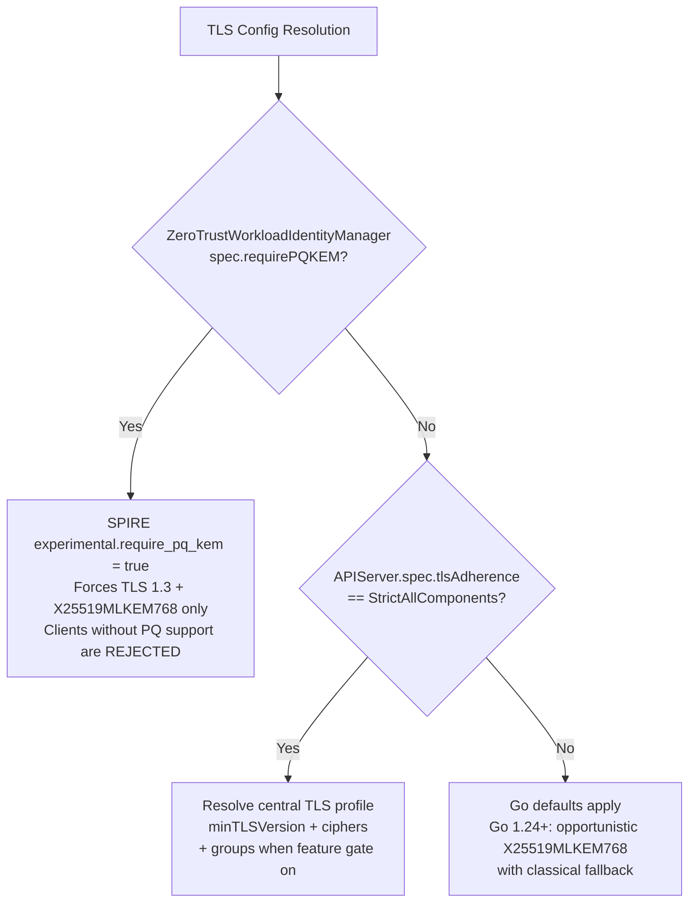

## *Enforce cluster-wide TLS profile and enable hybrid post-quantum key exchange on all ZTWIM and SPIRE TLS-serving endpoints*

**Date:** 		May 7, 2026  
**Scope:**		Zero Trust Workload Identity Manager (ZTWIM) Operator  
**Status:** 		Proposed  **Status Changed Date:** June 28, 2026  
**Authors:** 		[Nandan Hegde](mailto:nandan.islur@gmail.com)  
**Other docs:**

- [TLS Profile Compliance  Implementation ref](https://docs.google.com/document/d/1NoHP2nZdg-xUkcB2y2BtI8469-iicdSG7xJwRad4kF0/edit?tab=t.0#heading=h.p836qlye75wr)  
- [Openshift Enhancement Proposal](https://github.com/openshift/enhancements/pull/1910/changes)  
- [Reference Implementation](https://github.com/openshift/cluster-control-plane-machine-set-operator/blob/85f92f79174d6df783f631eb3187f0e11e89cc96/pkg/tls/tls.go)  
- [OCPSTRAT-2611 — Central TLS Consistency](https://redhat.atlassian.net/browse/OCPSTRAT-2611)  
- [OCPSTRAT-3123 — TLS Group Preferences](https://redhat.atlassian.net/browse/OCPSTRAT-3123)  
- [OCPSTRAT-3145 — Hybrid ML-KEM Support](https://redhat.atlassian.net/browse/OCPSTRAT-3145)  
- [OCPSTRAT-2361](https://redhat.atlassian.net/browse/OCPSTRAT-2361)  
- [Red Hat — PQC in OpenShift 4.20 Control Plane](https://www.redhat.com/en/blog/deeper-look-post-quantum-cryptography-support-red-hat-openshift-420-control-plane)  
- [Kubernetes — Post-Quantum Cryptography in Kubernetes](https://kubernetes.io/blog/2025/07/18/pqc-in-k8s/)  
- [openshift/api PR #2583 — TLS groups field](https://github.com/openshift/api/pull/2583)

# What

This ADR addresses two overlapping OpenShift initiatives for ZTWIM and its SPIRE operands. It proposes a two-layer fix — `controller-runtime-common/pkg/tls` for the operator itself, and injected configuration for upstream SPIRE operands — with an application-level PQC override. The key decisions are:

**1. Overlapping initiative: central TLS consistency + application-level hybrid ML-KEM.**  
(a) Central TLS Consistency (OCPSTRAT-2611) — all ZTWIM/SPIRE TLS server endpoints must honor the cluster-wide TLS profile from `apiserver.config.openshift.io/cluster` (minTLSVersion, ciphers, and groups when the `TLSGroupPreferences` feature gate is available).  
(b) Hybrid ML-KEM support (OCPSTRAT-3145) — SPIRE workload identity workflows (server–agent communication, workload–workload mTLS) can enforce quantum-safe hybrid key exchange (X25519MLKEM768) via the upstream `experimental.require_pq_kem` config, exposed as a **single operands-wide flag** on the `ZeroTrustWorkloadIdentityManager` CRD (`spec.requirePQKEM`).

**2. Precedence: application-specific `require_pq_kem` takes priority over central TLS profile.**  
When `spec.requirePQKEM: true` is set on the `ZeroTrustWorkloadIdentityManager` CR (`cluster`), the operator propagates `experimental.require_pq_kem = true` into SPIRE Server, SPIRE Agent, OIDC Discovery Provider and SPIRE Controller Manager configs. SPIRE's PQ policy then takes full control (`CurvePreferences: [X25519MLKEM768]`, TLS 1.3 minimum). The central TLS profile settings (minTLSVersion, ciphers, groups) are NOT injected. When `requirePQKEM` is absent or false, the central TLS profile is enforced only when `APIServer.spec.tlsAdherence` is `StrictAllComponents` (see **Layer 2 injection trigger** below); otherwise Go defaults (component defaults) apply — Go 1.24+ opportunistically prefers X25519MLKEM768 but gracefully falls back to classical curves if the peer does not support it.

**3. Change propagation: APIServer object changes cause rolling restart of operator, then operands.**  
Per the established guidelines: when the cluster admin changes the TLS profile or `tlsAdherence` on the APIServer resource (`apiserver.config.openshift.io/cluster`), the ZTWIM operator's SecurityProfileWatcher fires, cancels its context, and the operator pod restarts with the new profile. During reconciliation, the operator resolves the updated profile into SPIRE config, updates ConfigMaps, and the resulting hash change triggers rolling restarts of SPIRE operand workloads (StatefulSet, DaemonSet, Deployments).

**4. Testing with `tls-scanner`: validation that org-level TLS consistency expectations are met.**  
TLS compliance is validated using OpenShift's `tls-scanner` tool against all TLS-serving endpoints. This is the primary mechanism for verifying that endpoints negotiate the expected TLS version, cipher suites, and key exchange groups. TLS observability (CurveID, PQC vs classical) is being addressed via testing.

**5. Endpoints covered and what each means.**

*Downstream (ZTWIM operator):*

- Metrics server (:8443) — Prometheus scrape endpoint for operator metrics

*Upstream operands managed by ZTWIM:*

- SPIRE Server gRPC TCP API (:8081) — the main registration and attestation API; SPIRE Agent connects here  
- SPIRE Server federation bundle endpoint (:8443) — HTTPS endpoint serving trust bundles for cluster federation  
- SPIRE Server Prometheus server (:8082) — metrics scrape endpoint for SPIRE Server telemetry  
- OIDC Discovery Provider (:8443) — HTTPS endpoint serving OIDC discovery documents and JWKS for JWT-SVID verification  
- SPIRE Controller Manager webhook server (:9443) — admission webhooks for SPIRE CRDs

*Not covered (no change needed):*

- SPIRE Agent Socket (UDS only) — Unix domain socket, not TLS

# Why

- OCP 4.23 / 5.0 release blocker. When `APIServer.spec.tlsAdherence` is `StrictAllComponents`, non-compliant components block cluster upgrades.  
- PQC readiness. ML-KEM key encapsulation requires TLS 1.3. Components must inherit profile settings so customers can enable PQC ciphers platform-wide.  
- Customer custom profiles are silently ignored. Customers who disable specific ciphers via custom TLS profiles get no enforcement from ZTWIM/SPIRE.  
- SPIRE Server ↔ Agent and Workload ↔ Workload mTLS must support quantum-safe key exchange via hybrid X25519MLKEM768 (combines classical X25519 + ML-KEM-768). Pure ML-KEM is not available — it is a safety net design: ML-KEM was standardized only in Aug 2024 (FIPS 203) and if a future classical attack breaks it, X25519 still protects the session.  
- Go 1.24+ already negotiates X25519MLKEM768 by default when `Config.CurvePreferences` is nil. The challenge is giving admins explicit control to either enforce PQC (no classical fallback) or follow the central TLS profile.

## **Goals**

- All ZTWIM/SPIRE TLS server endpoints honor `apiserver.config.openshift.io/cluster` TLS profile.  
- Profile changes (both the profile and adherencePolicy) propagate automatically (watch + rolling restart).  
- Zero behavior change for default Intermediate profile (TLS 1.2) or when `APIServer.spec.tlsAdherence` is not `StrictAllComponents` (including omitted, empty, `LegacyAdheringComponentsOnly`, and forward-compatible unknown values treated per OpenShift API).  
- CSV can declare tls-profiles: "true".  
- Users can enforce hybrid PQC key exchange (X25519MLKEM768) via `requirePQKEM: true` in the ZTWIM CRD. This maps to SPIRE's `experimental.require_pq_kem`, restricts CurvePreferences to X25519MLKEM768 only, and rejects clients that cannot negotiate it.  
- `requirePQKEM` (application-level) takes precedence over the central TLS profile when set. When `requirePQKEM` is absent: central TLS profile is injected into operands only when `tlsAdherence=StrictAllComponents`; otherwise Go defaults apply (opportunistic PQC with classical fallback).  
- TLS compliance validated extensively with OpenShift `tls-scanner` against all endpoints.

## **Non-Goals**

- Changing TLS client settings (out of scope per PQC guidance).  
- Changing the cluster default profile (remains Intermediate / TLS 1.2).  
- Hot-reload of TLS configuration within SPIRE processes — operator and operands restart on profile change; there is no in-process hot-reload of TLS settings.  
- ML-DSA (post-quantum digital signatures) — signing certificates with PQC algorithms is out of scope. PQC signature schemes (ML-DSA / FIPS 204, SLH-DSA / FIPS 205) are not yet mature in Go or the broader ecosystem. This ADR covers only key exchange (KEM), not certificate signing.  
- Pure ML-KEM (mlkem-only) mode — not available in Go or IETF standards. Only hybrid X25519MLKEM768 is supported. The hybrid approach is a safety net: if ML-KEM is broken by future cryptanalysis, the classical X25519 component still protects the session.

# How

### **Two-Layer Architecture**

SPIRE is an upstream CNCF project that does not understand OpenShift TLS profiles. The solution splits into two layers:

- Layer 1 (Direct): ZTWIM operator uses controller-runtime-common/pkg/tls to fetch and watch the cluster TLS profile and `tlsAdherence` for its own metrics and webhook servers. On profile change or on `tlsAdherence` change the SecurityProfileWatcher (`OnProfileChange` / `OnAdherencePolicyChange` callbacks) cancels the context, causing a graceful restart.
- Layer 2 (Injected): ZTWIM operator reconcilers resolve the cluster TLS profile into concrete MinTLSVersion and CipherSuites values, then inject them as config variables into SPIRE operand containers **only when Layer 2 injection triggers** (see below). ConfigMap hash changes trigger rolling restarts.

### **Terminology: `tlsAdherence`**

Use the OpenShift APIServer field name consistently:

| Name | Meaning |
| ---- | ------- |
| `APIServer.spec.tlsAdherence` | JSON field on `apiserver.config.openshift.io/cluster` (Go: `TLSAdherence`) |
| `StrictAllComponents` | All components must honor the cluster `tlsSecurityProfile` unless a component-specific override exists |
| `LegacyAdheringComponentsOnly` | Only components that already honor the cluster profile continue to do so; others keep individual TLS settings |
| Omitted / empty | Platform default (`LegacyAdheringComponentsOnly` today) |

`OnAdherencePolicyChange` is the controller-runtime-common callback name for changes to `tlsAdherence` — not a separate APIServer field.

### **Layer 2 injection trigger (operands)**

Central profile injection into SPIRE operand ConfigMaps (`minTLSVersion`, `cipherSuites`, future `groups`) applies **only when all** of the following hold:

1. `ZeroTrustWorkloadIdentityManager.spec.requirePQKEM` is **false or absent**, and  
2. `APIServer.spec.tlsAdherence` is **`StrictAllComponents`** (unknown values are treated as `StrictAllComponents` per OpenShift API forward-compatibility guidance).

When `requirePQKEM` is false/absent and `tlsAdherence` is **`LegacyAdheringComponentsOnly`**, omitted, empty, or any non-`StrictAllComponents` value, Layer 2 **does not** inject the central profile. Operands fall back to Go defaults (Intermediate-equivalent: TLS 1.2 minimum, empty cipher suite list; Go 1.24+ may opportunistically negotiate X25519MLKEM768).

Layer 1 (operator metrics/webhook TLS) follows controller-runtime-common semantics for all adherence modes independently of Layer 2.

### **Precedence Model: `require_pq_kem` vs Central TLS Profile**

- `require_pq_kem` is an **application-level override** controlled by `ZeroTrustWorkloadIdentityManager.spec.requirePQKEM`. When true, the operator injects `experimental.require_pq_kem = true` into SPIRE Server, SPIRE Agent, OIDC Discovery Provider, and SPIRE Controller Manager configs. The central TLS profile's `minTLSVersion`, `ciphers`, and `groups` are **not injected** into SPIRE config. SPIRE's own `tlspolicy` module handles enforcement internally.
- When `require_pq_kem` is absent or false, Layer 2 injection applies **only when** `tlsAdherence=StrictAllComponents`: resolve central profile → inject `minTLSVersion`, `cipherSuites`, and (future) `groups` into SPIRE config. For all other `tlsAdherence` values, Layer 2 skips central profile injection and Go defaults provide opportunistic PQC — Go 1.24+ prefers X25519MLKEM768 when both peers support it, and gracefully falls back to classical curves otherwise.

### **Determining Effective TLS Configuration**

| requirePQKEM (ZTWIM CRD) | `APIServer.spec.tlsAdherence`                                | TLS security profile                 | Final TLS used                                                                                                   | PQC behavior                                                                          |
| ------------------ | ------------------------------------------------------------ | ------------------------------------ | ---------------------------------------------------------------------------------------------------------------- | ------------------------------------------------------------------------------------- |
| **true**           | Any                                                          | Any                                  | TLS 1.3, CurvePreferences: X25519MLKEM768 — SPIRE enforces via tlspolicy                                         | **Strict**: hybrid PQ only, clients without X25519MLKEM768 are rejected               |
| false / absent     | StrictAllComponents (or unknown for forward compat)          | Old / Intermediate / Modern / Custom | respective profile: min TLS + cipher list. (For Modern Profile, ciphers are not set as per GO TLS 1.3 behaviour) | **Profile-driven**: Go defaults provide opportunistic PQ if groups not explicitly set |
| false / absent     | StrictAllComponents                                          | Fetch failed or profile unset        | Intermediate: TLS 1.2 min; empty cipher suite                                                                    | **Opportunistic**: Go 1.24+ prefers X25519MLKEM768 if peer supports, else classical   |
| false / absent     | NoOpinion / "" / LegacyAdheringComponentsOnly / fetch failed | Any                                  | Intermediate: TLS 1.2 min; empty cipher suite                                                                    | **Opportunistic**: Go 1.24+ negotiates PQ when available, classical fallback          |

**Summary**: When `ZeroTrustWorkloadIdentityManager.spec.requirePQKEM` is true, the operator propagates PQ policy to all SPIRE operands; SPIRE enforces TLS 1.3 + hybrid X25519MLKEM768 only. Otherwise, *StrictAllComponents* (and forward-compatible unknown) modes honor the cluster-resolved profile. All other adherence values use the default Intermediate fallback. In all non-`require_pq_kem` cases, Go 1.24+ will opportunistically negotiate PQC if both peers support it.

### **Downstream Changes (ZTWIM Operator)**

| Change                                                         | File                                                                                                               | What                                                                                                                                                                                                                                                         |
| -------------------------------------------------------------- | ------------------------------------------------------------------------------------------------------------------ | ------------------------------------------------------------------------------------------------------------------------------------------------------------------------------------------------------------------------------------------------------------ |
| **Add dependency**                                             | go.mod                                                                                                             | Add github.com/openshift/controller-runtime-common                                                                                                                                                                                                           |
| **Register scheme**                                            | cmd/.../main.go init()                                                                                             | configv1.Install(scheme)                                                                                                                                                                                                                                     |
| **Fetch apply profile**                                        | cmd/.../main.go main()                                                                                             | Resolve cluster TLS (adherence profile) → NewTLSConfigFromProfile → append to metrics / webhook TLSOpts before NewManager.                                                                                                                                   |
| **Watch restart operator**                                     | cmd/.../main.go after mgr creation                                                                                 | SecurityProfileWatcher: OnProfileChange / OnAdherencePolicyChange → cancel context → mgr.Start ends → process exits → operator pod restart.                                                                                                                  |
| **APIServer in cache**                                         | pkg/client/client.go                                                                                               | Include configv1.APIServer{} in cache & informerResources so GetClient() can serve the apiServer object during reconcile                                                                                                                                     |
| **Resolve profile for operands (no dedicated watch)**          | Shared: pkg/controller/tls/tls.go (or extend existing)                                                             | Helpers to resolve min TLS string cipher list from APIServer/cluster (same semantics as operator). Called from each operand config generator during reconcile.                                                                                               |
| **Inject minTLSVersion and cipherSuite into operands config.** | pkg/controller/spire-server/statefulset.go, spire-agent/daemonset.go, spire-oidc-discovery-provider/deployments.go | Config change causes hash update and thus triggering rolling restart                                                                                                                                                                                         |
| **RBAC**                                                       | config/rbac/role.yaml                                                                                              | get/list/watch on config.openshift.io/apiservers                                                                                                                                                                                                             |
| **CSV annotation**                                             | config/manifests/bases/...clusterserviceversion.yaml                                                               | tls-profiles: "true"                                                                                                                                                                                                                                         |
| **Add PQC flag to operator CRD**                               | api/v1alpha1/zero_trust_workload_identity_manager_types.go                                                         | Add `RequirePQKEM *bool` to `ZeroTrustWorkloadIdentityManagerSpec`. Sole user-facing control for strict hybrid PQC (`X25519MLKEM768`). `true` → operator injects `experimental.require_pq_kem = true` into all SPIRE operand configs; `false`/absent → central TLS profile or Go defaults. |
| **Inject requirePQKEM into SPIRE Server config**               | pkg/controller/spire-server/configmap.go                                                                           | In `generateServerConfMap`: read ZTWIM `spec.requirePQKEM`; if true, emit `"experimental": {"require_pq_kem": true}` and skip injecting minTLSVersion/cipherSuites from the central profile. |
| **Inject requirePQKEM into SPIRE Agent config**                | pkg/controller/spire-agent/configmap.go                                                                            | In `generateAgentConfig`: read ZTWIM `spec.requirePQKEM`; if true, emit `"experimental": {"require_pq_kem": true}` (agent-to-server mTLS only). |
| **Inject requirePQKEM into OIDC Discovery Provider config (operator Layer 2)** | pkg/controller/spire-oidc-discovery-provider/configmaps.go | In `generateOIDCConfigMapFromCR`: when ZTWIM `spec.requirePQKEM=true`, add `"experimental": {"require_pq_kem": true}` to `oidc-discovery-provider.conf` and skip central `minTLSVersion`/`cipherSuites` injection; when false/absent and `tlsAdherence=StrictAllComponents`, inject central profile TLS fields into the same ConfigMap JSON. |
| **OIDC TLS/PQC enforcement in upstream binary (upstream patch)** | spire/support/oidc-discovery-provider/main.go | Upstream SPIRE patch (not ZTWIM operator code): read `minTLSVersion`, `cipherSuites`, and `experimental.require_pq_kem` from the injected ConfigMap/HCL in `newListenerWithServingCert()` and `newACMEListener()` when building `tls.Config`. Operator responsibility ends at ConfigMap content; operand process applies settings. |
| **Inject requirePQKEM into Controller Manager config**       | pkg/controller/spire-server/configmap.go                                                                           | In `generateControllerManagerConfigMap`: propagate same ZTWIM flag into ctrl-mgr config / env for webhook TLS when upstream patch supports it. |
| **Warning event on PQ + strict adherence coexistence**         | pkg/controller/spire-server/controller.go, pkg/controller/spire-agent/controller.go                              | When `spec.requirePQKEM=true` and `tlsAdherence=StrictAllComponents`, emit Warning event that application-level PQ policy overrides central profile injection. |

### **Upstream Changes (SPIRE, SPIRE Controller Manager)**

These are downstream patches initially, with upstream PRs to follow.

| Change                                                           | File                                          | What                                                                                                |
| ---------------------------------------------------------------- | --------------------------------------------- | --------------------------------------------------------------------------------------------------- |
| **Configurable TLS on SPIRE Server gRPC (TCP)**                  | spire/pkg/server/endpoints/endpoints.go       | Read MinVersion and CipherSuites from HCL config instead of hardcoding tls.VersionTLS12             |
| **Configurable TLS on federation bundle HTTPS (all auth modes)** | spire/pkg/server/endpoints/bundle/server.go   | Read min version from config instead of hardcoding                                                  |
| **Configurable TLS on Prometheus scrape server (HTTPS)**         | spire/pkg/common/telemetry/prometheus.go      | Add MinTLSVersion and CipherSuites to Config; use in GetTLSConfig() with fallback to TLS 1.2        |
| **Configurable TLS in OIDC provider**                            | spire/support/oidc-discovery-provider/main.go | Read TLS settings from config                                                                       |
| **Configurable TLS in ctrl-mgr webhook**                         | spire-controller-manager/cmd/main.go          | Read TLSMINVERSION and TLSCIPHERSUITES from config in webhook TLSOpts instead of hardcoding TLS 1.2 |

*All upstream changes follow the same pattern: read from config, parse, apply. Fall back to current behavior (TLS 1.2, Go default ciphers) when config is unset. When `[require_pq_kem](https://github.com/spiffe/spire/blob/f634aaa8625a84438a51fdd628e1f218ec1862c6/doc/spire_agent.md?plain=1#L85)` is set via the ZTWIM CRD, it takes precedence: SPIRE's `tlspolicy` module forces TLS 1.3 and `CurvePreferences: [X25519MLKEM768]`. Central TLS profile values (minTLSVersion, cipherSuites, groups) are NOT injected when `require_pq_kem` is active.*

### **Change Propagation Flow**

- Cluster admin changes either   
  - TLS profile on [apiserver.config.openshift.io/cluster](http://apiserver.config.openshift.io/cluster) OR  
  - `tlsAdherence` on [apiserver.config.openshift.io/cluster](http://apiserver.config.openshift.io/cluster)
- ZTWIM operator SecurityProfileWatcher fires → operator restarts with new profile on its own TLS servers  
- Reconcilers resolve profile → update configMap and the config hash change restarts operand workloads  
- New operand pods start with updated TLS settings from config

### **Verification**

- tls-scanner against all TLS endpoints for each profile type (Old, Intermediate, Modern, Custom)  
- Operator reconciliation on `tlsAdherence` value change  
- Unit tests for profile resolution and ConfigMap/StatefulSet generation  
- Integration test: change profile from Intermediate to Modern, verify all endpoints comply  
- Custom profile test: disable specific ciphers, verify not offered by any endpoint  
- `require_pq_kem: true` in CRD produces SPIRE config with `experimental.require_pq_kem = true`  
- `require_pq_kem: true` suppresses central TLS profile injection into SPIRE config  
- With `require_pq_kem` absent and StrictAllComponents, central profile settings are injected  
- TLS scanner / `openssl s_client` validates X25519MLKEM768 is negotiated when `require_pq_kem` is enabled  
- Unit test: config precedence matrix (PQ override vs. central profile vs. default)  
- Verify non-PQC client receives handshake failure when `require_pq_kem` is enabled

### **Migration**

Phased rollout:

- Phase 1: Operator compliance — central TLS profile for ZTWIM's own servers (metrics, webhook).  
- Phase 2: Config injection into operands — central TLS profile for SPIRE (gRPC, federation, OIDC, Prometheus, ctrl-mgr webhook).  
- Phase 3: CRD `requirePQKEM` field + `experimental.require_pq_kem` injection into Operands config.  
- Phase 4 (Future): `groups` field support once `openshift/api` is vendored with PR #2583 and `TLSGroupPreferences` feature gate graduates.

## **Alternatives**

| Alternative                              | Verdict  | Reason                                                                                                                                         |
| ---------------------------------------- | -------- | ---------------------------------------------------------------------------------------------------------------------------------------------- |
| **Sidecar TLS proxy (Envoy/HAProxy)**    | Rejected | Breaks SPIFFE mTLS verification — SPIRE must see client certs directly. Adds latency and operational complexity.                               |
| **Fork SPIRE permanently**               | Rejected | Unsustainable maintenance burden. SPIRE is actively developed; security patches must be manually backported.                                   |
| **Per-operand PQC flags (SpireServer / SpireAgent CRDs)** | Rejected | Allows server-only or agent-only enablement → handshake failures and partial compliance; ctrl-mgr has no operand CRD. |
| **Single `requirePQKEM` on ZeroTrustWorkloadIdentityManager CR** | Chosen | One cluster-wide flag; operator propagates to server, agent, and controller-manager configs — consistent PQC posture without per-operand footguns. |
| **Config update minimal upstream patch** | Chosen   | Minimal divergence, leverages SPIRE's expandEnv, easy to upstream as general 'configurable TLS'. Small downstream patch until upstream merges. |

## **Risks**

| Risk                                                                                               | Likelihood            | Impact                                                                                                                                 | Mitigation                                                                                                                        |
| -------------------------------------------------------------------------------------------------- | --------------------- | -------------------------------------------------------------------------------------------------------------------------------------- | --------------------------------------------------------------------------------------------------------------------------------- |
| **Rolling restart on profile change or `tlsAdherence` change causes brief SPIRE API unavailability** | Expected              | Seconds of unavailability per pod                                                                                                      | StatefulSet rolling update; PodDisruptionBudget; agents auto-reconnect                                                            |
| **Cipher suite mismatch — Go does not support all OpenSSL names**                                  | Expected              | Some ciphers silently skipped                                                                                                          | Log unsupported ciphers; use standard mapping from PQC reference code                                                             |
| `**require_pq_kem` causes handshake failures with non-PQC clients**                                | Expected when enabled | SPIRE agents/clients that do not support X25519MLKEM768 cannot connect                                                                 | `require_pq_kem` is opt-in; all SPIRE agents and workloads must be on Go 1.24+ before enabling; upgrade agents first, then server |
| **Go version mismatch between components**                                                         | Medium                | Silent downgrade to classical KEM — Go 1.23 used draft X25519Kyber768Draft00, Go 1.24+ uses standardized X25519MLKEM768 (incompatible) | Pin all components to same Go version; without `require_pq_kem`, downgrade to classical is graceful, not a failure                |
| `**require_pq_kem` overrides central profile — admin confusion**                                   | Medium                | Two TLS control planes appear to conflict                                                                                              | Document precedence clearly; emit warning event when both are set                                                                 |
| **ML-KEM ClientHello packet size exceeds MTU**                                                     | Low                   | Some network appliances may not handle fragmented ClientHello (see [tldr.fail](https://tldr.fail))                                     | Test with corporate proxies/firewalls before enabling                                                                             |
| `**TLSGroupPreferences` feature gate not yet graduated**                                           | Expected              | `groups` field unavailable via central profile                                                                                         | `require_pq_kem` serves as interim PQC enforcement                                                                                |

# Reviews

Anybody may review the document and provide feedback.  Acceptance and rejection is reserved for those people noted in the appropriate "Accept / Reject" section of each ADR.

| Reviewed by | Date | Notes |
| ----------- | ---- | ----- |
|             |      |       |
|             |      |       |
|             |      |       |

