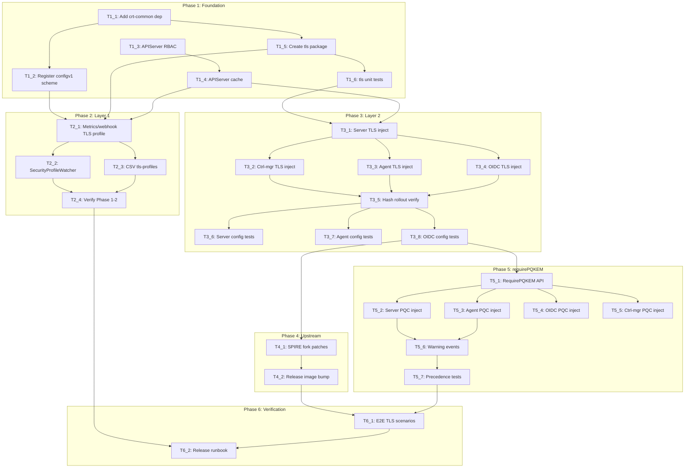

# Execution Backlog

**Feature:** TLS Profile Compliance and Hybrid Post-Quantum Key Exchange
**AgentRoutingMode:** PROVIDED
**ConstitutionVersion:** 1.0

## 0. Input coverage checklist

| Requirement                                                   | Task IDs                                 |
| ------------------------------------------------------------- | ---------------------------------------- |
| **FR-001** Operator metrics/webhook honor cluster profile     | T2_1, T2_2, T6_1                         |
| **FR-002** Operator restart on profile/adherence change       | T2_2                                     |
| **FR-003** Layer 2 inject central profile when strict + no PQ | T3_1, T3_2, T3_3, T3_4, T3_6, T3_7, T3_8 |
| **FR-004** No injection when non-strict adherence             | T1_5, T1_6, T3_6                         |
| **FR-005** Single `requirePQKEM` on ZTWIM CR                  | T5_1                                     |
| **FR-006** Propagate PQC to all operands                      | T5_2, T5_3, T5_4, T5_5                   |
| **FR-007** PQ suppresses central profile injection            | T5_2, T5_3, T5_4, T5_5, T5_7             |
| **FR-008** Warning event when PQ + strict                     | T5_6, T5_7                               |
| **FR-009** Operand rollout on profile change                  | T3_5, T3_6                               |
| **FR-010** All in-scope operand TLS endpoints                 | T3_1–T3_4, T4_1                          |
| **FR-011** Operands read injected TLS from config             | T4_1, T4_2                               |
| **FR-012** CSV declares tls-profiles support                  | T2_3                                     |
| **FR-013** RBAC + read APIServer during reconcile             | T1_3, T1_4                               |
| **FR-014** Zero behavior change on default cluster            | T1_6, T3_6, T5_7                         |
| **SC-001–SC-008**                                             | T2_4, T3_6–T3_8, T5_7, T6_1, T6_2        |
| **Story 1 (P1)** Operator TLS                                 | T2_1, T2_2, T2_4                         |
| **Story 2 (P1)** Operand profile under strict                 | T3_1–T3_8, T4_1, T6_1                    |
| **Story 3 (P2)** Propagation / rolling restart                | T2_2, T3_5, T3_6                         |
| **Story 4 (P2)** requirePQKEM / PQC                           | T5_1–T5_7                                |
| **Story 5 (P3)** tls-scanner / qualification                  | T6_1, T6_2                               |
| **Plan Phase 1** Foundation                                   | T1_1–T1_6                                |
| **Plan Phase 2** Layer 1 operator                             | T2_1–T2_4                                |
| **Plan Phase 3** Layer 2 injection                            | T3_1–T3_8                                |
| **Plan Phase 4** Upstream cross-repo                          | T4_1, T4_2                               |
| **Plan Phase 5** requirePQKEM                                 | T5_1–T5_7                                |
| **Plan Phase 6** Verification                                 | T6_1, T6_2                               |
| **Plan Phase 7** (deferred)                                   | — out of scope                           |

## 1. Task Dependency Graph (Mermaid)

## 2. Linear Execution Order (Chronological)

1. T1_1 — Add controller-runtime-common dependency
2. T1_2 — Register configv1 scheme in main.go
3. T1_3 — Add APIServer read RBAC
4. T1_4 — Register APIServer in client cache
5. T1_5 — Create shared TLS resolution package
6. T1_6 — Unit tests for TLS resolution and adherence gate
7. T2_1 — Apply cluster TLS profile to operator metrics and webhook
8. T2_2 — Wire SecurityProfileWatcher for operator restart
9. T2_3 — Enable CSV tls-profiles annotation and regenerate bundle
10. T2_4 — Verify Phase 1–2 (make verify && make test)
11. T3_1 — Inject central profile into SPIRE server ConfigMap
12. T3_2 — Inject central profile into controller-manager ConfigMap
13. T3_3 — Inject central profile into SPIRE agent ConfigMap
14. T3_4 — Inject central profile into OIDC ConfigMap
15. T3_5 — Verify config-hash rollout on StatefulSet/DaemonSet/Deployment
16. T3_6 — Unit tests: server ConfigMap TLS injection and hash
17. T3_7 — Unit tests: agent ConfigMap TLS injection
18. T3_8 — Unit tests: OIDC ConfigMap TLS injection
19. T4_1 — Coordinate upstream SPIRE/ctrl-mgr configurable TLS patches (out of tree)
20. T5_1 — Add RequirePQKEM field to ZTWIM API and regenerate manifests/bundle
21. T5_2 — Add PQC injection branch to server ConfigMap generator
22. T5_3 — Add PQC injection branch to agent ConfigMap generator
23. T5_4 — Add PQC injection branch to OIDC ConfigMap generator
24. T5_5 — Add PQC injection branch to ctrl-mgr ConfigMap generator
25. T5_7 — Unit tests: precedence matrix and warning event
26. T6_1 — Add e2e TLS compliance scenarios
27. T6_2 — Document release qualification runbook (tls-scanner matrix)

## 3. Task Execution Manifest

| Task ID | Task Title                                        | Assigned Agent           | Phase   | Depends On       | Parallel OK | Complexity | Risk |
| ------- | ------------------------------------------------- | ------------------------ | ------- | ---------------- | ----------- | ---------- | ---- |
| T1_1    | Add controller-runtime-common dependency          | OperatorController_Agent | Phase 1 | none             | No          | 2          | Low  |
| T1_2    | Register configv1 scheme in main.go               | OperatorController_Agent | Phase 1 | T1_1             | No          | 1          | Low  |
| T1_3    | Add APIServer read RBAC                           | RBACSecurity_Agent       | Phase 1 | none             | Yes         | 2          | Low  |
| T1_4    | Register APIServer in client cache                | OperatorController_Agent | Phase 1 | T1_3             | No          | 3          | Med  |
| T1_5    | Create pkg/controller/tls resolution package      | OperatorController_Agent | Phase 1 | T1_1             | No          | 5          | Med  |
| T1_6    | Unit tests for TLS package                        | Testing_Agent            | Phase 1 | T1_5             | No          | 3          | Low  |
| T2_1    | Apply cluster TLS profile to operator TLS servers | OperatorController_Agent | Phase 2 | T1_2, T1_4, T1_5 | No          | 5          | Med  |
| T2_2    | Wire SecurityProfileWatcher operator restart      | OperatorController_Agent | Phase 2 | T2_1             | No          | 3          | Med  |
| T2_3    | Set CSV tls-profiles true and regenerate bundle   | OLMRelease_Agent         | Phase 2 | T2_1             | Yes         | 2          | Low  |
| T2_4    | Verify Phase 1–2 gates                            | Testing_Agent            | Phase 2 | T2_2, T2_3       | No          | 2          | Low  |
| T3_1    | Server ConfigMap central profile injection        | OperatorController_Agent | Phase 3 | T1_6, T1_4       | No          | 5          | Med  |
| T3_2    | Ctrl-mgr ConfigMap central profile injection      | OperatorController_Agent | Phase 3 | T3_1             | No          | 3          | Med  |
| T3_3    | Agent ConfigMap central profile injection         | OperatorController_Agent | Phase 3 | T3_1             | Yes         | 3          | Med  |
| T3_4    | OIDC ConfigMap central profile injection          | OperatorController_Agent | Phase 3 | T3_1             | Yes         | 3          | Med  |
| T3_5    | Verify hash-driven operand rollout                | OperatorController_Agent | Phase 3 | T3_2, T3_3, T3_4 | No          | 2          | Low  |
| T3_6    | Unit tests: server TLS injection                  | Testing_Agent            | Phase 3 | T3_5             | No          | 3          | Low  |
| T3_7    | Unit tests: agent TLS injection                   | Testing_Agent            | Phase 3 | T3_5             | Yes         | 2          | Low  |
| T3_8    | Unit tests: OIDC TLS injection                    | Testing_Agent            | Phase 3 | T3_5             | Yes         | 2          | Low  |
| T4_1    | Upstream SPIRE/ctrl-mgr TLS patches               | Docs_Agent               | Phase 4 | T3_8             | No          | 8          | High |
| T4_2    | Release repo operand image bump                   | Docs_Agent               | Phase 4 | T4_1             | No          | 5          | High |
| T5_1    | Add RequirePQKEM to ZTWIM API                     | API_Agent                | Phase 5 | T3_8             | No          | 3          | Low  |
| T5_2    | Server ConfigMap PQC injection branch             | OperatorController_Agent | Phase 5 | T5_1             | No          | 3          | Med  |
| T5_3    | Agent ConfigMap PQC injection branch              | OperatorController_Agent | Phase 5 | T5_1             | Yes         | 2          | Med  |
| T5_4    | OIDC ConfigMap PQC injection branch               | OperatorController_Agent | Phase 5 | T5_1             | Yes         | 2          | Med  |
| T5_5    | Ctrl-mgr ConfigMap PQC injection branch           | OperatorController_Agent | Phase 5 | T5_1             | Yes         | 2          | Med  |
| T5_6    | Warning events for PQ + strict adherence          | OperatorController_Agent | Phase 5 | T5_2, T5_3       | No          | 2          | Low  |
| T5_7    | Unit tests: precedence matrix and events          | Testing_Agent            | Phase 5 | T5_6             | No          | 5          | Med  |
| T6_1    | E2E TLS compliance test scenarios                 | Testing_Agent            | Phase 6 | T4_2, T5_7       | No          | 8          | High |
| T6_2    | Release qualification runbook                     | Docs_Agent               | Phase 6 | T6_1, T2_4       | No          | 3          | Med  |

**Totals:** 29 tasks | Complexity points: 89 | High risk: 3 (T4_1, T4_2, T6_1) | Parallel OK: 8 tasks

## 4. Task Specifications (Payloads)

### Task T1_1: Add controller-runtime-common dependency

- **Objective:** Add `github.com/openshift/controller-runtime-common` for Layer 1 TLS profile integration.
- **Target file(s):** `go.mod`, `go.sum`, `vendor/`
- **Non-goals / forbidden edits:** Do not bump unrelated dependencies; run `make vendor` and commit vendor diff per constitution.
- **Implementation notes:** Pin version compatible with controller-runtime 0.22.4 / Go 1.25.7 (plan §8 Q1 — verify against reference operator before merge).
- **Acceptance criteria:** `go build ./...` succeeds; vendor committed; FR-013 prerequisite met.
- **Downstream handoff:** T1_2 and T1_5 can import crt-common/tls packages.

### Task T1_2: Register configv1 scheme in main.go

- **Objective:** Register OpenShift config API types so APIServer objects can be read.
- **Target file(s):** `cmd/zero-trust-workload-identity-manager/main.go`
- **Non-goals / forbidden edits:** Do not implement full Layer 1 TLS yet (Phase 2); scheme registration only.
- **Implementation notes:** Follow existing pattern for `securityv1`, `routev1` scheme registration in `init()` or `main()`.
- **Acceptance criteria:** `configv1.Install(scheme)` or equivalent; compiles; no runtime TLS behavior change yet.
- **Downstream handoff:** T2_1 can resolve APIServer TLS profile.

### Task T1_3: Add APIServer read RBAC

- **Objective:** Grant operator read-only access to cluster APIServer configuration.
- **Target file(s):** `config/rbac/role.yaml`
- **Non-goals / forbidden edits:** No write verbs; no RBAC broadening beyond get/list/watch (constitution Human Approval Gates).
- **Implementation notes:** `config.openshift.io/apiservers` resource; regenerate bundle in T2_3 or immediately if testing locally requires it.
- **Acceptance criteria:** FR-013; least-privilege RBAC only.
- **Downstream handoff:** T1_4 cache can list/watch APIServer.

### Task T1_4: Register APIServer in client cache

- **Objective:** Add `configv1.APIServer{}` to cache and informer resource lists.
- **Target file(s):** `pkg/client/client.go`
- **Non-goals / forbidden edits:** Do not use raw client.Client; maintain CustomCtrlClient pattern.
- **Implementation notes:** Add to `cacheResourceWithoutReqSelectors` and `informerResources` (repo-assessment §2.2); cluster-scoped — no namespace selector.
- **Acceptance criteria:** Reconcilers can Get APIServer via `GetClient()` during reconcile; FR-013.
- **Downstream handoff:** T1_5, T3_x can read tlsAdherence and tlsSecurityProfile.

### Task T1_5: Create pkg/controller/tls resolution package

- **Objective:** Shared helpers for profile resolution, adherence gate, and injection decision logic.
- **Target file(s):** `pkg/controller/tls/tls.go` (new)
- **Non-goals / forbidden edits:** No operand-specific JSON shaping here — export reusable functions only.
- **Implementation notes:** Implement precedence: `requirePQKEM` (future) > strict adherence central profile > no injection; unknown adherence → StrictAllComponents per OpenShift API; map profile types to min TLS + cipher lists.
- **Acceptance criteria:** FR-004 gate logic; callable from config generators in Phase 3/5.
- **Downstream handoff:** T1_6 tests; T3_1 consumes helpers.

### Task T1_6: Unit tests for TLS package

- **Objective:** Table-driven tests for adherence matrix and profile mapping.
- **Target file(s):** `pkg/controller/tls/tls_test.go` (new)
- **Non-goals / forbidden edits:** No e2e; use fake APIServer objects or test fixtures.
- **Implementation notes:** Cover: StrictAllComponents + no PQ → inject; LegacyAdhering/omitted → skip; unknown adherence → strict; fetch failure → Intermediate fallback.
- **Acceptance criteria:** `make test` passes; FR-004, FR-014 edge cases; plan Phase 1 verification.
- **Downstream handoff:** Phase 3 implementation can rely on tested helpers.

### Task T2_1: Apply cluster TLS profile to operator TLS servers

- **Objective:** Layer 1 — metrics `:8443` and webhook TLS honor cluster profile via crt-common.
- **Target file(s):** `cmd/zero-trust-workload-identity-manager/main.go`
- **Non-goals / forbidden edits:** Preserve existing metrics auth filter (`WithAuthenticationAndAuthorization`); preserve HTTP/2 disable behavior unless profile requires otherwise.
- **Implementation notes:** Replace ad-hoc `metricsTLSOpts` profile application with `NewTLSConfigFromProfile`; append to metrics and webhook `TLSOpts` before `NewManager`.
- **Acceptance criteria:** FR-001; Story 1 scenarios 1–2; SC-001 (manual cluster verify documented if no unit test).
- **Downstream handoff:** T2_2 watcher; operator endpoints ready for tls-scanner Phase 1 scope.

### Task T2_2: Wire SecurityProfileWatcher operator restart

- **Objective:** On TLS profile or tlsAdherence change, cancel root context so operator pod restarts with new TLS config.
- **Target file(s):** `cmd/zero-trust-workload-identity-manager/main.go`
- **Non-goals / forbidden edits:** No hot-reload inside process; exit and rely on Deployment restart.
- **Implementation notes:** Register `SecurityProfileWatcher` with `OnProfileChange` / `OnAdherencePolicyChange` callbacks; use cancellable context passed to `mgr.Start`.
- **Acceptance criteria:** FR-002; Story 1 scenario 3; Story 3 scenario 1.
- **Downstream handoff:** T2_4 verification; operand Layer 2 still uses reconcile-driven rollout separately.

### Task T2_3: Set CSV tls-profiles true and regenerate bundle

- **Objective:** Declare operator as TLS-profile-aware in OLM CSV.
- **Target file(s):** `config/manifests/bases/zero-trust-workload-identity-manager.clusterserviceversion.yaml`, regenerated `bundle/`
- **Non-goals / forbidden edits:** Edit bases only — not generated bundle by hand.
- **Implementation notes:** Set `features.operators.openshift.io/tls-profiles: "true"`; run `make bundle`.
- **Acceptance criteria:** FR-012; grep bundle for tls-profiles true.
- **Downstream handoff:** OLM installs recognize TLS profile support.

### Task T2_4: Verify Phase 1–2 gates

- **Objective:** Confirm foundation and Layer 1 pass constitution hard gates.
- **Target file(s):** N/A (verification only)
- **Non-goals / forbidden edits:** Fix failures in prior tasks — do not expand scope.
- **Implementation notes:** Run `make verify && make test`; document manual operator metrics handshake steps for SC-001 if no automated test yet.
- **Acceptance criteria:** All gates pass; Story 1 independent test path documented.
- **Downstream handoff:** Phase 3 may proceed; tls-scanner CI scope for operator endpoints can start (specs A-006).

### Task T3_1: Server ConfigMap central profile injection

- **Objective:** When Layer 2 triggers, inject minTLSVersion/cipherSuites into SPIRE server config JSON.
- **Target file(s):** `pkg/controller/spire-server/configmap.go` (`generateServerConfMap`)
- **Non-goals / forbidden edits:** Do not add requirePQKEM logic yet (Phase 5); skip injection when gate false.
- **Implementation notes:** Read ZTWIM + APIServer via tls helpers; update hash via existing `generateConfigHash` path.
- **Acceptance criteria:** FR-003; Story 2 scenarios 1–2 (ConfigMap level before live handshake).
- **Downstream handoff:** T3_2 shares pattern; hash change triggers T3_5 rollout.

### Task T3_2: Ctrl-mgr ConfigMap central profile injection

- **Objective:** Inject central TLS settings into controller-manager YAML ConfigMap for webhook TLS when upstream supports it.
- **Target file(s):** `pkg/controller/spire-server/configmap.go` (`generateSpireControllerManagerConfigYaml`)
- **Non-goals / forbidden edits:** No upstream fork changes in this repo.
- **Implementation notes:** Same Layer 2 gate as T3_1; prepare env/YAML fields per ADR for ctrl-mgr webhook :9443.
- **Acceptance criteria:** FR-003, FR-010 (ctrl-mgr webhook class); config content verifiable in unit tests.
- **Downstream handoff:** T4_1 upstream patch consumes injected values.

### Task T3_3: Agent ConfigMap central profile injection

- **Objective:** Inject central profile into agent-to-server mTLS config when Layer 2 triggers.
- **Target file(s):** `pkg/controller/spire-agent/configmap.go`
- **Non-goals / forbidden edits:** UDS workload API unchanged (FR-0010 out of scope).
- **Implementation notes:** Agent config generator already receives `ztwim`; add TLS fields to agent conf JSON/HCL structure per SPIRE schema.
- **Acceptance criteria:** FR-003; Story 2; FR-004 non-strict case skips injection.
- **Downstream handoff:** T3_7 unit tests.

### Task T3_4: OIDC ConfigMap central profile injection

- **Objective:** Inject central profile TLS fields into `oidc-discovery-provider.conf` JSON.
- **Target file(s):** `pkg/controller/spire-oidc-discovery-provider/configmaps.go` (`generateOIDCConfigMapFromCR`)
- **Non-goals / forbidden edits:** Do not patch upstream `spire/support/oidc-discovery-provider/main.go` in operator repo (specs A-011).
- **Implementation notes:** Operator stops at ConfigMap content; upstream reads injected fields (Phase 4).
- **Acceptance criteria:** FR-003; Story 2; aligns with ADR operator/upstream split.
- **Downstream handoff:** T3_8 tests; T4_1 upstream OIDC patch.

### Task T3_5: Verify hash-driven operand rollout

- **Objective:** Confirm ConfigMap TLS changes propagate via existing hash annotations to roll pods.
- **Target file(s):** `pkg/controller/spire-server/statefulset.go`, `pkg/controller/spire-agent/daemonset.go`, `pkg/controller/spire-oidc-discovery-provider/deployments.go`
- **Non-goals / forbidden edits:** Evidence: PARTIAL for OIDC deployment hash — verify and fix gap if missing (plan §8 Q5).
- **Implementation notes:** Server/agent patterns confirmed in repo-assessment; align OIDC Deployment if annotation missing.
- **Acceptance criteria:** FR-009; Story 3 scenarios 1–3; hash changes when injected config changes.
- **Downstream handoff:** T3_6–T3_8 test hash delta behavior.

### Task T3_6: Unit tests: server TLS injection

- **Objective:** Assert server and ctrl-mgr ConfigMaps receive correct TLS fields and hash updates.
- **Target file(s):** `pkg/controller/spire-server/configmaps_test.go`
- **Non-goals / forbidden edits:** Follow counterfeiter fake client pattern.
- **Implementation notes:** Extend existing config hash tests; cases for strict vs non-strict adherence; FR-014 default unchanged.
- **Acceptance criteria:** `make test` passes; FR-003, FR-004, FR-009, FR-014.
- **Downstream handoff:** Phase 4 e2e can focus on live handshakes.

### Task T3_7: Unit tests: agent TLS injection

- **Objective:** Assert agent ConfigMap injection and skip paths.
- **Target file(s):** `pkg/controller/spire-agent/configmap_test.go` (or existing test file)
- **Non-goals / forbidden edits:** Scope to agent-to-server TLS only.
- **Acceptance criteria:** `make test` passes; FR-003, FR-004.
- **Downstream handoff:** T5_3 builds on same test file.

### Task T3_8: Unit tests: OIDC TLS injection

- **Objective:** Assert OIDC ConfigMap JSON includes TLS fields when Layer 2 triggers.
- **Target file(s):** `pkg/controller/spire-oidc-discovery-provider/configmaps_test.go`
- **Non-goals / forbidden edits:** No upstream binary tests in operator repo.
- **Acceptance criteria:** `make test` passes; FR-003; Story 2 ConfigMap-level coverage.
- **Downstream handoff:** T4_1, T5_1 unblocked.

### Task T4_1: Upstream SPIRE/ctrl-mgr TLS patches

- **Objective:** Track and coordinate configurable TLS patches in fork repos (out of tree).
- **Target file(s):** UNVERIFIED — `openshift/spiffe-spire`, `openshift/spiffe-spire-controller-manager` (Evidence: PARTIAL)
- **Non-goals / forbidden edits:** No SPIRE logic in ZTWIM operator repo (constitution Principle VI).
- **Implementation notes:** Deliver patches per ADR upstream table: server gRPC, federation, Prometheus, OIDC main.go, ctrl-mgr webhook; upstream unit tests in fork.
- **Acceptance criteria:** FR-011; operand processes read minTLSVersion, cipherSuites, require_pq_kem from config; blocks SC-002 live handshakes until done.
- **Downstream handoff:** T4_2 image bump; T6_1 e2e.

### Task T5_1: Add RequirePQKEM to ZTWIM API

- **Objective:** Expose single cluster-wide PQC opt-in on operator CR.
- **Target file(s):** `api/v1alpha1/zero_trust_workload_identity_manager_types.go`, `config/crd/bases/`, `bundle/`
- **Non-goals / forbidden edits:** No per-operand CRD fields; API before controller (constitution routing).
- **Implementation notes:** `RequirePQKEM *bool` optional; kubebuilder markers; run `make generate manifests bundle verify`.
- **Acceptance criteria:** FR-005; ZTWIMSpecChangedPredicate triggers operand reconcile on toggle.
- **Downstream handoff:** T5_2–T5_5 PQC injection branches.

### Task T5_2: Server ConfigMap PQC injection branch

- **Objective:** When `requirePQKEM=true`, emit `experimental.require_pq_kem` and skip central profile fields.
- **Target file(s):** `pkg/controller/spire-server/configmap.go`
- **Non-goals / forbidden edits:** Do not inject minTLSVersion/cipherSuites when PQ active (FR-007).
- **Implementation notes:** Read `ztwim.Spec.RequirePQKEM`; integrate with tls package precedence helper.
- **Acceptance criteria:** FR-006, FR-007; Story 4 scenario 1.
- **Downstream handoff:** T5_6 warning event; T5_7 tests.

### Task T5_3: Agent ConfigMap PQC injection branch

- **Objective:** Propagate require_pq_kem to agent config for agent-to-server mTLS.
- **Target file(s):** `pkg/controller/spire-agent/configmap.go`
- **Non-goals / forbidden edits:** UDS path unchanged.
- **Acceptance criteria:** FR-006, FR-007; Story 4.
- **Downstream handoff:** T5_6, T5_7.

### Task T5_4: OIDC ConfigMap PQC injection branch

- **Objective:** Add experimental.require_pq_kem to OIDC ConfigMap when flag set.
- **Target file(s):** `pkg/controller/spire-oidc-discovery-provider/configmaps.go`
- **Non-goals / forbidden edits:** Upstream listener applies config (Phase 4 dependency for live verify).
- **Acceptance criteria:** FR-006, FR-007; Story 4 scenario 1 includes OIDC config.
- **Downstream handoff:** T5_7; T6_1 PQC scan.

### Task T5_5: Ctrl-mgr ConfigMap PQC injection branch

- **Objective:** Propagate PQC flag to ctrl-mgr config for webhook TLS.
- **Target file(s):** `pkg/controller/spire-server/configmap.go` (ctrl-mgr generator)
- **Non-goals / forbidden edits:** Depends on upstream ctrl-mgr reading config (T4_1).
- **Acceptance criteria:** FR-006, FR-007; FR-010 webhook class.
- **Downstream handoff:** T5_7 tests.

### Task T5_6: Unit tests: precedence matrix and events

- **Objective:** Cover PQ vs profile vs default matrix and warning event cases.
- **Target file(s):** `pkg/controller/tls/tls_test.go`, `pkg/controller/spire-server/configmaps_test.go`, controller tests as needed
- **Non-goals / forbidden edits:** Live PQC handshake requires Phase 4 images — document manual SC-004 steps separately in T6_1.
- **Implementation notes:** Table cases from specs precedence matrix; FR-014 default cluster unchanged.
- **Acceptance criteria:** `make verify && make test`; FR-005–FR-008, FR-014; Story 4 unit-level coverage.
- **Downstream handoff:** T6_1 e2e for live X25519MLKEM768.

### Task T6_1: E2E TLS compliance test scenarios

- **Objective:** Add Ginkgo scenarios for TLS profile and PQC compliance on test cluster.
- **Target file(s):** `test/e2e/` (Evidence: PARTIAL — follow existing e2e layout)
- **Non-goals / forbidden edits:** Requires patched operand images (T4_2) for full operand coverage.
- **Implementation notes:** Scenarios for Story 1–5, SC-001–SC-004, SC-008; tls-scanner integration if tooling available (plan §8 Q4).
- **Acceptance criteria:** `make test-e2e` passes on qualifying cluster; SC-007 CI portion for operator endpoints.
- **Downstream handoff:** T6_2 release runbook references e2e suite.

### Task T6_2: Release qualification runbook

- **Objective:** Document manual tls-scanner matrix (Old/Intermediate/Modern/Custom) and PQC qualification gate.
- **Target file(s):** UNVERIFIED — `docs/` or release notes path (Evidence: PARTIAL)
- **Non-goals / forbidden edits:** Documentation only — no code changes unless linking from README.
- **Implementation notes:** Per specs A-006 — CI for phased operator scans; full matrix at GA; include requirePQKEM upgrade ordering (A-004).
- **Acceptance criteria:** SC-007 release gate documented; SC-008 upgrade readiness checklist.
- **Downstream handoff:** Implementation stage complete; ready for `/opsx-apply` per task.

## 5. Orchestration notes (non-code)

### Retry Boundaries

- **Safe to retry:** T1_1–T1_6, T2_1–T2_4, T3_1–T3_8, T5_1–T5_7 — operator repo tasks isolated by phase; rerun `make verify && make test` after each.
- **Retry with coordination:** T4_1, T4_2 — external fork/release repo; retry only after upstream PR merge and digest availability confirmed.
- **Not safely parallel:** T5_1 (API) must complete before T5_2–T5_5; T3_1 before T3_2–T3_4 (shared precedence contract).
- **Create-only mode:** Any ConfigMap task (T3_x, T5_2–T5_5) has no effect when `CREATE_ONLY_MODE=true` — document in runbook, not a task failure.

### Merge Conflict Hotspots

| Hotspot                                    | Mitigation                                                                              |
| ------------------------------------------ | --------------------------------------------------------------------------------------- |
| `go.mod` / `vendor/`                       | Serialize T1_1; re-run `make vendor` before merge                                       |
| `cmd/.../main.go`                          | T1_2 and T2_1–T2_2 touch same file — execute sequentially                               |
| `pkg/controller/spire-server/configmap.go` | T3_1, T3_2, T5_2, T5_5 — sequential within Phase 3 then Phase 5                         |
| `config/crd/bases/`, `bundle/`             | Regenerate via `make manifests bundle` after API tasks; never hand-merge generated YAML |
| `pkg/client/client.go`                     | T1_4 only in Phase 1 — avoid concurrent cache list edits                                |

### Open Questions Requiring SME Before Execution

| Question                                  | Blocks                        | Default if unresolved                                               |
| ----------------------------------------- | ----------------------------- | ------------------------------------------------------------------- |
| crt-common version pin (plan §8 Q1)       | T1_1                          | Match cluster-control-plane-machine-set-operator reference          |
| Upstream fork patch status (plan §8 Q2)   | T4_1, T6_1 operand handshakes | Proceed operator-only; e2e operand cases skipped until images ready |
| tls-scanner CI location (plan §8 Q4)      | T6_1 automation scope         | Manual qualification in T6_2; e2e without scanner initially         |
| OIDC Deployment hash pattern (plan §8 Q5) | T3_5                          | Discover in T3_5; add annotation fix in same task if gap found      |

