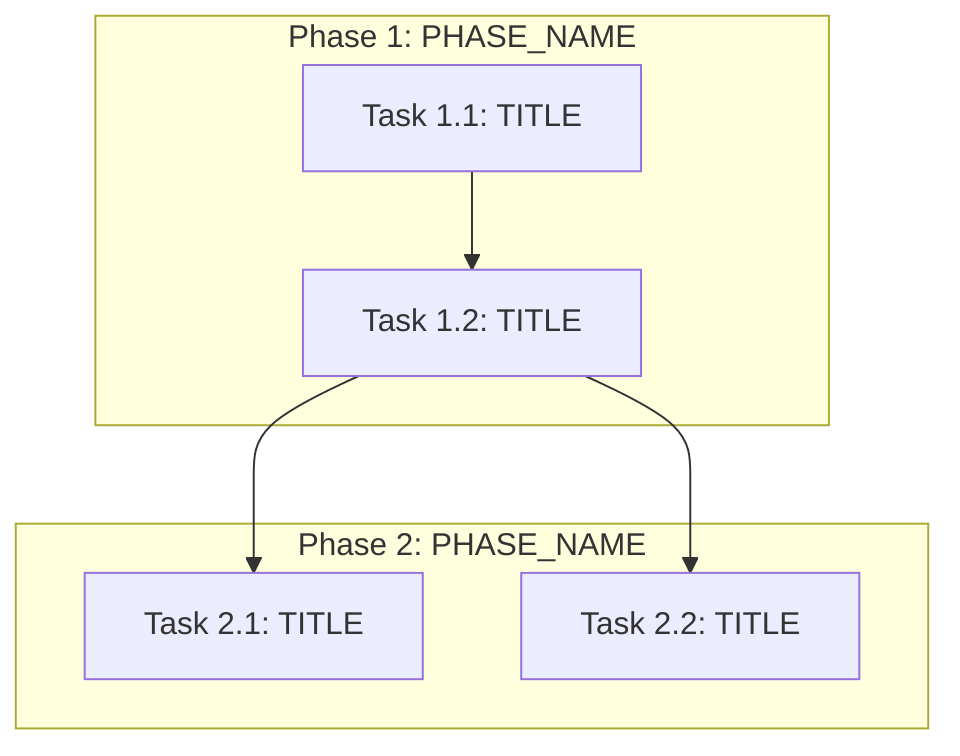

## Mode: Skeleton (`pass_mode: skeleton`)

Generate §0 through §3 ONLY. Do NOT generate §4 or §5.

### Completeness rules
- **Generation priority when space-constrained:** §0 coverage checklist → §3 manifest (all tasks) →
  §2 linear order → §1 DAG.
- Verification tasks: pair substantive implementation tasks with test tasks when constitution requires.
  Use actual Makefile targets from repo_assessment (e.g., `make test`, not `make test-unit` unless evidenced).

### Output sections — use these EXACT headings

## 0. Input coverage checklist
Short bullet list mapping spec goals + plan phases → task coverage (prove nothing obvious was dropped).
One bullet per spec requirement (FR-xx, SC-xx, AC-xx) and plan phase, each with the Task IDs that
cover it.

## 1. Task Dependency Graph (Mermaid)
Use `graph TD` (or `flowchart LR`) with stable node IDs like `T1_1`, `T1_2`, ... matching Task IDs.



## 2. Linear Execution Order (Chronological)
Numbered list of Task IDs in a valid topological order (ties broken by phase order from technical_plan.md).

## 3. Task Execution Manifest (table)
A markdown table with EXACT columns:
| Task ID | Task Title | Assigned Agent | Phase | Depends On | Parallel OK | Complexity | Risk |
|---------|-----------|---------------|-------|-----------|------------|-----------|------|
| T1_1 | [TITLE] | [AGENT_ID] | [PHASE] | none | No | [1-8] | [Low/Med/High] |

### tasks_index.json

Additionally, emit a fenced JSON block labeled `tasks_index.json` at the end of your response
containing a machine-parseable array of all tasks. Schema:

```json
[
  {
    "id": "T1_1",
    "title": "Short task title",
    "summary": "One-line description of what this task accomplishes",
    "phase": "Phase 1: Phase Name",
    "depends_on": ["T1_0"],
    "agent": "OperatorController_Agent",
    "parallel_ok": false,
    "complexity": 3,
    "risk": "Low"
  }
]
```

Required fields: `id`, `title`, `summary`, `phase`, `depends_on` (array, use `[]` for no deps),
`agent`, `parallel_ok` (boolean), `complexity` (integer 1|2|3|5|8), `risk` ("Low"|"Med"|"High").

The `summary` field is a single sentence describing the task's objective — it is used for
human review before detailed payloads are generated.

Output structure:
1. The full markdown for §0, §1, §2, §3
2. A fenced code block: ` ```json tasks_index.json ` containing the JSON array
3. Nothing else — no §4, no §5

### Quality self-check
- [ ] §0 lists every FR-xx, SC-xx, and plan phase with covering Task IDs
- [ ] AgentRoutingMode matches constitution.md (PROVIDED vs PROVISIONAL)
- [ ] §2 linear order is a valid topological sort of §1 DAG
- [ ] Assigned Agent values exist in agents.md (when PROVIDED) or match provisional IDs exactly
- [ ] §3 manifest row count matches tasks_index.json entry count
